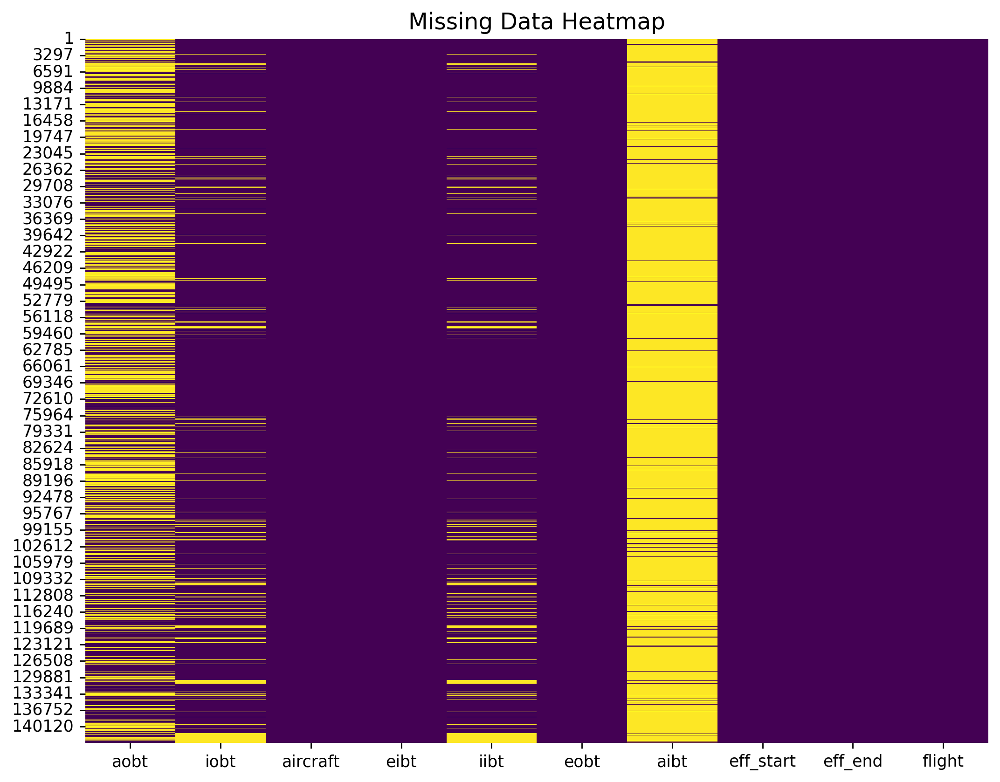
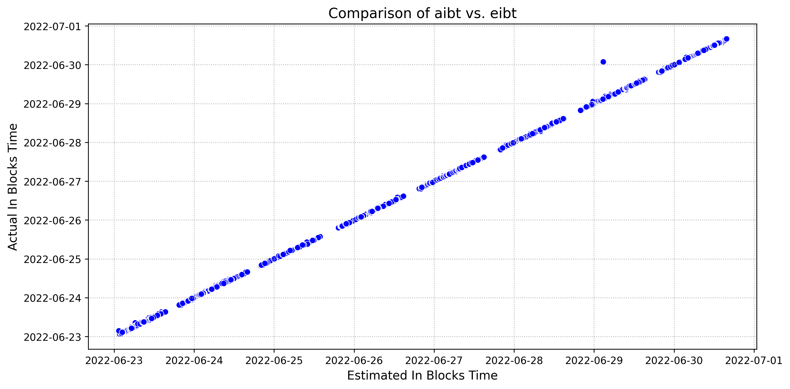
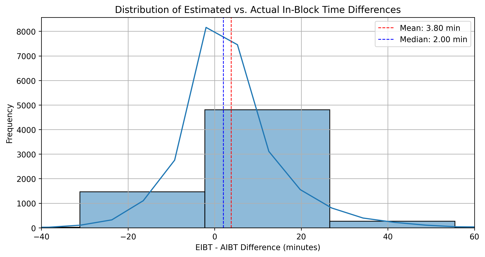
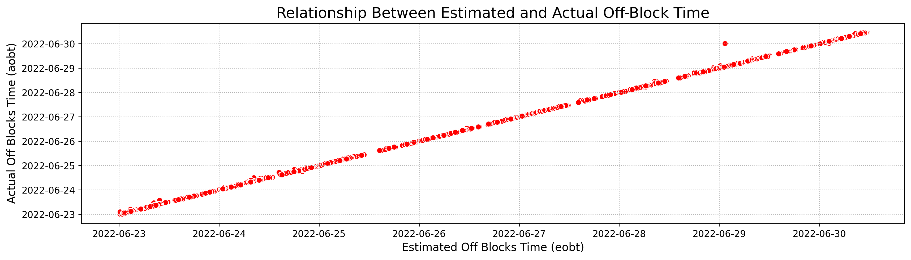
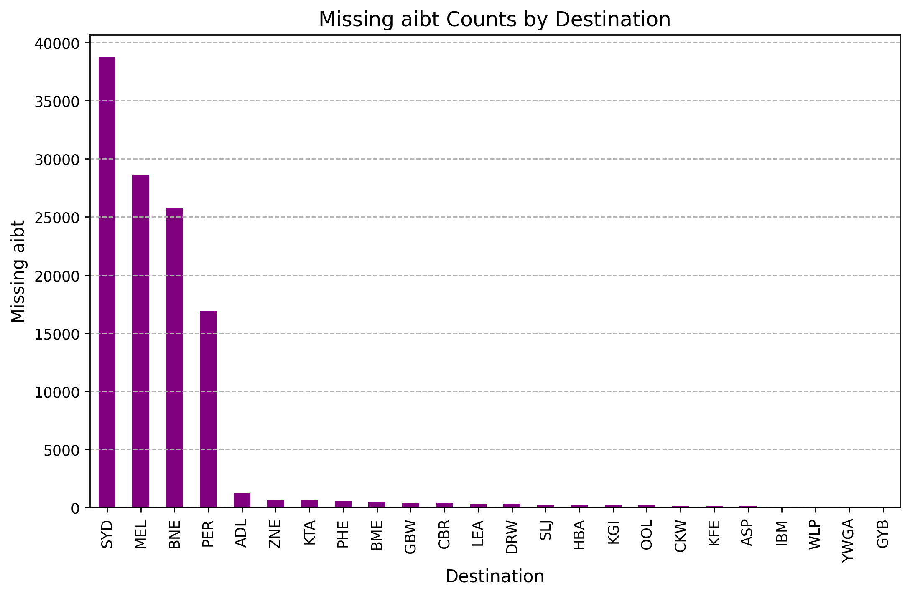

# Qantas Flight Data Analysis (Confidential Data Not Included)

## Project Overview
This project analyzes Qantas flight data to assess operational efficiency, on-time performance, and aircraft turnaround times. Due to confidentiality, the dataset is not included, but the code demonstrates the analysis process and methodologies used.

## Analysis and Insights
### 1️⃣ Missing Data Analysis
- A heatmap was generated to visualize missing values across different features.
- AIBT (Actual In-Block Time) had significant missing values, leading to the need for an imputation strategy.

### 2️⃣ Estimated vs Actual In-Block Time (EIBT vs AIBT)
- A scatter plot shows a strong correlation between **EIBT (Estimated In-Block Time)** and **AIBT (Actual In-Block Time)**, justifying the use of EIBT to fill missing AIBT values.

### 3️⃣ Distribution of EIBT - AIBT Differences
- The mean and median difference between **EIBT and AIBT** were calculated.
- The distribution indicates that most of the time, AIBT is very close to EIBT, supporting the decision to use EIBT for imputation.

### 4️⃣ Estimated vs Actual Off-Block Time (EOBT vs AOBT)
- Similar to in-block times, **EOBT (Estimated Off-Block Time)** and **AOBT (Actual Off-Block Time)** show a strong linear relationship.
- This justifies using EOBT as a reference when analyzing off-block delays.

### 5️⃣ Missing AIBT by Destination
- The majority of missing AIBT values were concentrated in key domestic airports (SYD, MEL, BNE, PER).

## Methods Used
- **Data Cleaning & Preprocessing:**
  - Handled missing values with **imputation techniques** (using EIBT for AIBT).
  - Verified and corrected inconsistencies in flight duration and time sequences.
- **Data Visualization:**
  - Used **Seaborn & Matplotlib** for scatter plots, histograms, and heatmaps.
  - Analyzed estimated vs actual performance with correlation plots.

## Key Takeaways
✔ **Aircraft changes per day** were successfully analyzed.
✔ **Departure and arrival performance** were visualized.
✔ **Missing values were effectively handled** using estimated timestamps.
✔ **Flight time distributions and delays were analyzed** for operational insights.

---
### ⚠ Disclaimer
The dataset used for this analysis is **private and will not be shared**. The repository only contains **analysis code and visualizations**.